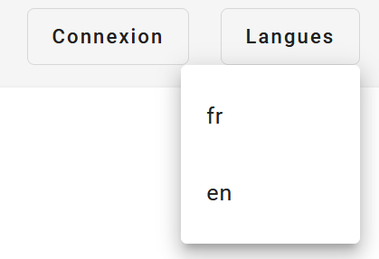
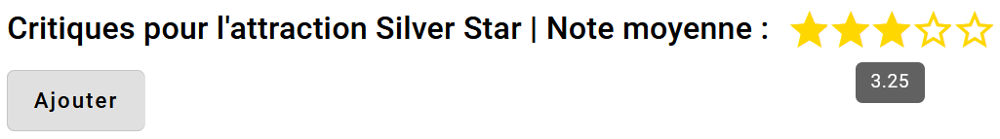
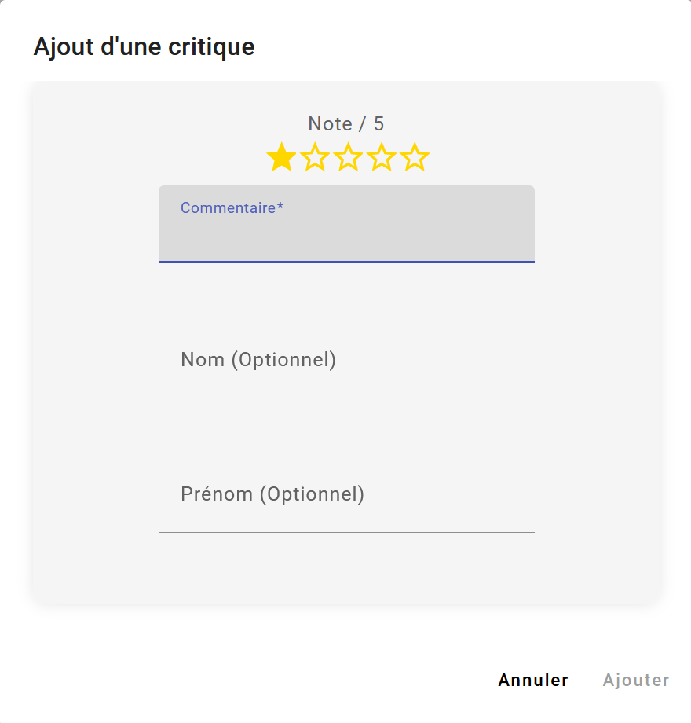
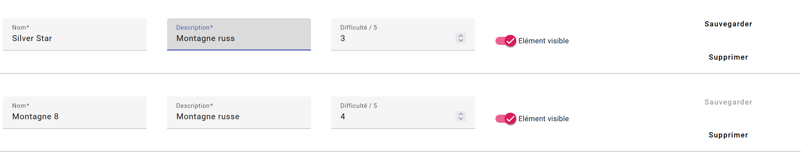
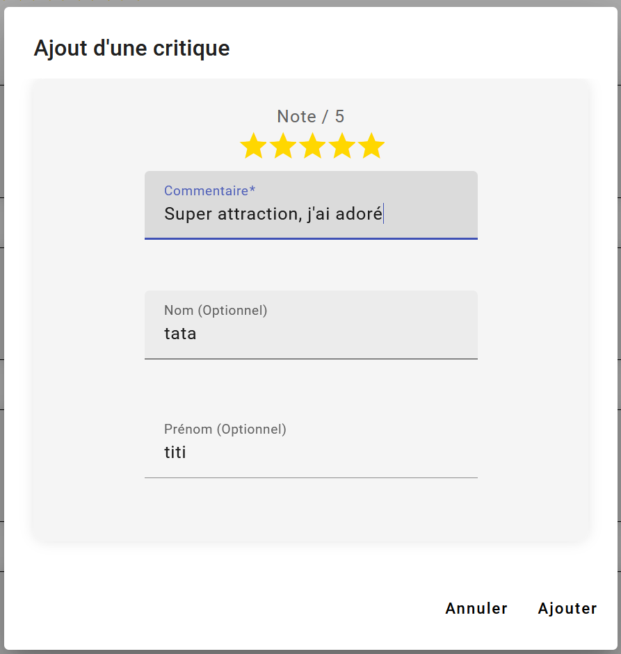

---
title: Documentation fonctionnelle
author: Tom Rouillon
date: 15/03/2024
...

<meta http-equiv="Content-Type" content="text/html; charset=UTF-8">

<body>

# Documentation fonctionnelle

## Page d'accueil

La page d'accueil est la première page que l'utilisateur voit lorsqu'il arrive sur le site. C'est aussi celle sur laquelle il est ramené si l'URL qu'il a tapée n'existe pas.

Il peut voir les critiques pour chaque attraction en cliquant sur le bouton `Voir`.

Il peut y trouver la liste de toutes les attractions du parc, avec des infos sur chacune d'entre elles. Il a aussi la possibilité de changer la langue de l'application en utilisant le menu déroulant `Langues` en haut à droite :

Enfin, il peut se connecter en tant qu'administrateur en cliquant sur le bouton `Connexion` en haut à droite.

## Critiques

Lorque l'utilisateur appui sur le bouton `Voir` de la page d'accueil pour une attraction, il est redirigé vers la page de critiques de cette attraction. L'URL sera du type `/attraction/<id_attraction>/critique`. 

Sur cette page, il peut voir la note moyenne, le nom de l'attraction et toutes les critiques qui ont déjà été postées. Il peut aussi ajouter sa propre critique en cliquant sur le bouton `Ajouter`.

A remarquer que lorsque la souris passe au dessus des étoiles, la note précise est affichée :

Il se retrouvera alors devant le formulaire suivant :

Pour choisir sa note, il peut cliquer sur les étoiles. Il peut aussi écrire un commentaire.
Ces 2 champs sont obligatoires, et il peut également indiquer son nom et son prénom s'il le souhaite. S'il ne le fait pas, son commentaire sera posté en tant qu'anonyme.
Enfin, il peut cliquer sur le bouton `Envoyer` pour envoyer sa critique.

## Administration

Lorsqu'un administrateur se connecte, il est redirigé vers la page d'administration. Il peut y voir la liste de toutes les attractions, et il peut en ajouter, en modifier ou en supprimer.

S'il modifie ou ajoute une attraction, mais qu'il ne clique pas sur le bouton `Enregistrer`, les modifications ne seront pas enregistrées. Pour essayer de réduire ce risque, le bouton est mis en évidence lorsqu'un changement a été fait :

Enfin, s'il va sur la page des critiques pour une attraction, il a la possibilité de modifier et de supprimer les critiques. Quand il veut modifier une critique, le même formulaire que pour ajouter une critique apparaît, mais il est pré-rempli avec les informations de la critique qu'il veut modifier :

Quand il se déconnecte, il est redirigé vers la page de connexion.

</body>